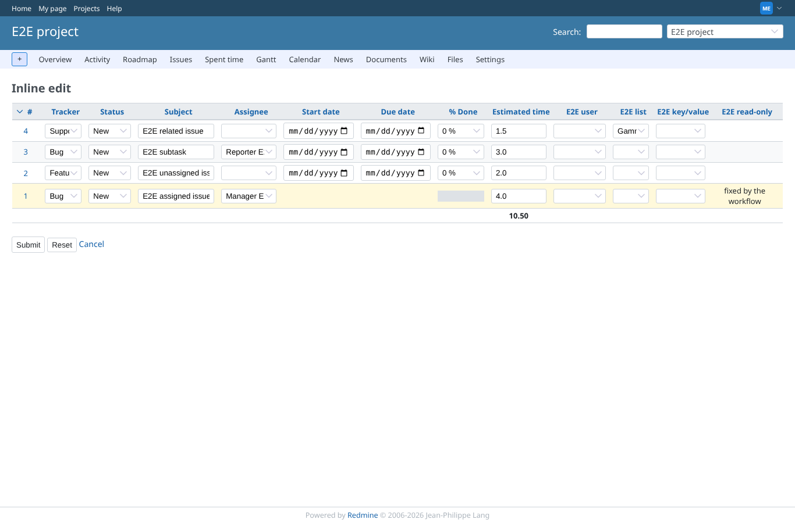
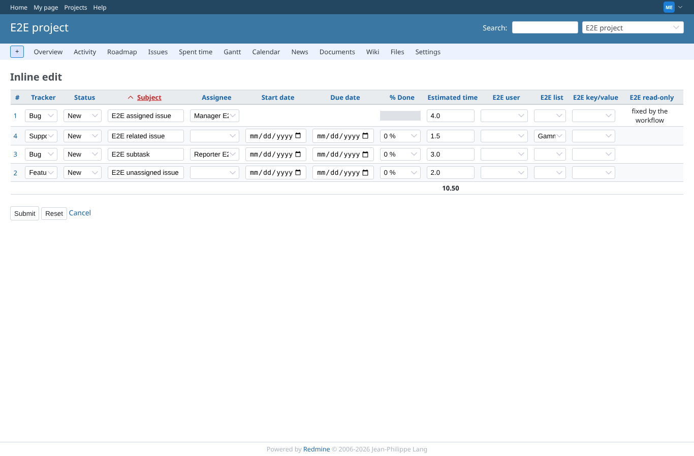
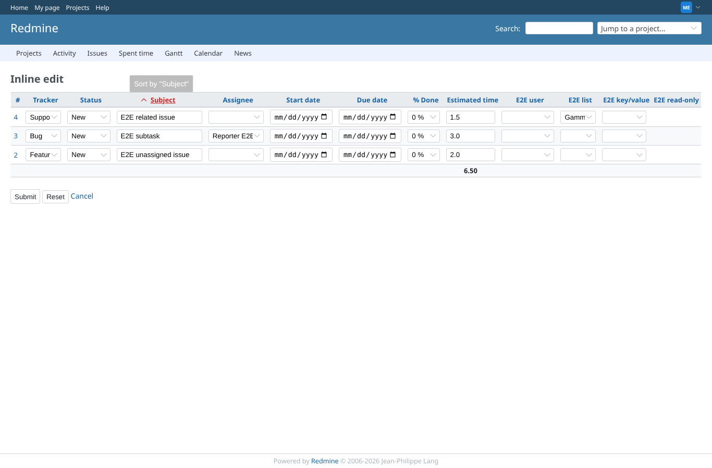

# edit-form

Run 2026-10-06T19:43:29.228Z against http://127.0.0.1:3000.

| screenshot | user | URL | shows |
|---|---|---|---|
|  | manager | `/projects/e2e-project/inline_issues/edit_multiple?ids[]=1&ids[]=2&ids[]=4&ids[]=3&set_filter=1&c[]=tracker&c[]=status&c[]=subject&c[]=assigned_to&c[]=start_date&c[]=due_date&c[]=done_ratio&c[]=estimated_hours&c[]=cf_1&c[]=cf_2&c[]=cf_3&c[]=cf_4` | Manager: every editable field is an input; the parent's derived dates and % done and the workflow read-only custom field "E2E read-only" are text |
|  | manager | `/projects/e2e-project/inline_issues/edit_multiple?c%5B%5D=tracker&c%5B%5D=status&c%5B%5D=subject&c%5B%5D=assigned_to&c%5B%5D=start_date&c%5B%5D=due_date&c%5B%5D=done_ratio&c%5B%5D=estimated_hours&c%5B%5D=cf_1&c%5B%5D=cf_2&c%5B%5D=cf_3&c%5B%5D=cf_4&ids%5B%5D=1&ids%5B%5D=2&ids%5B%5D=4&ids%5B%5D=3&set_filter=1&sort=subject%2Cid%3Adesc` | A click on the Subject header sorts the form and stays on it |
|  | manager | `/inline_issues/edit_multiple?ids[]=2&ids[]=4&ids[]=3&set_filter=1&c[]=tracker&c[]=status&c[]=subject&c[]=assigned_to&c[]=start_date&c[]=due_date&c[]=done_ratio&c[]=estimated_hours&c[]=cf_1&c[]=cf_2&c[]=cf_3&c[]=cf_4` | The form without a project in the URL works for issues the user may edit |
|  | developer | `/projects/e2e-project/inline_issues/edit_multiple?ids[]=1&ids[]=2&ids[]=4&ids[]=3&set_filter=1&c[]=tracker&c[]=status&c[]=subject&c[]=assigned_to&c[]=start_date&c[]=due_date&c[]=done_ratio&c[]=estimated_hours&c[]=cf_1&c[]=cf_2&c[]=cf_3&c[]=cf_4` | A member who may edit issues but lacks "Edit inline" is refused (403) |
|  | reporter | `/projects/e2e-project/inline_issues/edit_multiple?ids[]=1&ids[]=2&ids[]=4&ids[]=3&set_filter=1&c[]=tracker&c[]=status&c[]=subject&c[]=assigned_to&c[]=start_date&c[]=due_date&c[]=done_ratio&c[]=estimated_hours&c[]=cf_1&c[]=cf_2&c[]=cf_3&c[]=cf_4` | A member without the plugin's permission is refused (403) |
|  | outsider | `/projects/e2e-private/inline_issues/edit_multiple` | A non-member is refused on the private project (403) |
|  | anonymous | `/login?back_url=http%3A%2F%2F127.0.0.1%3A3000%2Fprojects%2Fe2e-project%2Finline_issues%2Fedit_multiple%3Fids%5B%5D%3D1%26ids%5B%5D%3D2%26ids%5B%5D%3D4%26ids%5B%5D%3D3%26set_filter%3D1%26c%5B%5D%3Dtracker%26c%5B%5D%3Dstatus%26c%5B%5D%3Dsubject%26c%5B%5D%3Dassigned_to%26c%5B%5D%3Dstart_date%26c%5B%5D%3Ddue_date%26c%5B%5D%3Ddone_ratio%26c%5B%5D%3Destimated_hours%26c%5B%5D%3Dcf_1%26c%5B%5D%3Dcf_2%26c%5B%5D%3Dcf_3%26c%5B%5D%3Dcf_4` | Anonymous: the form asks to log in first |
