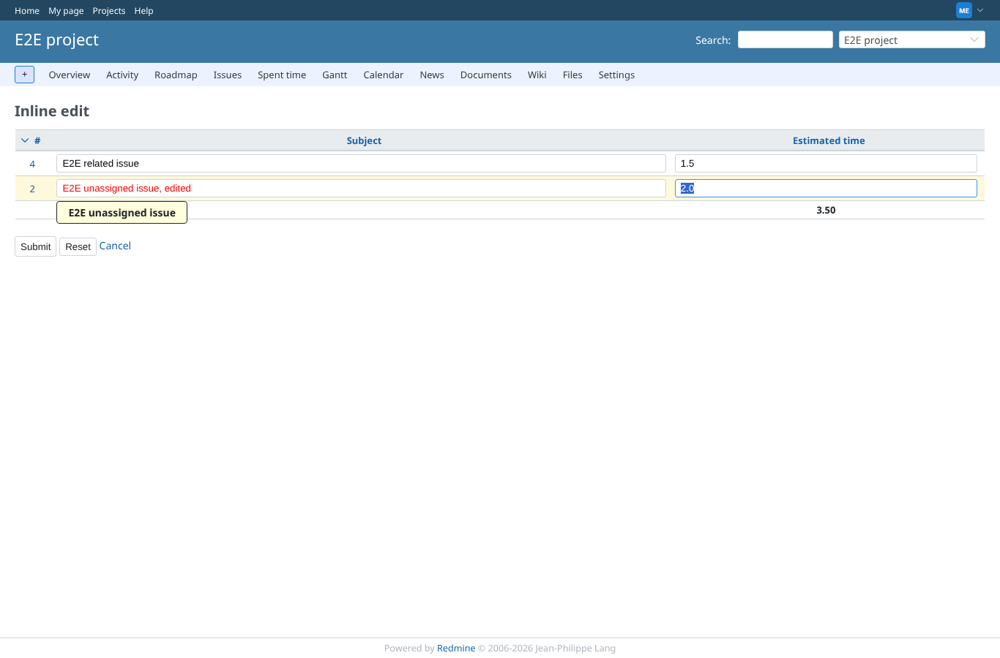
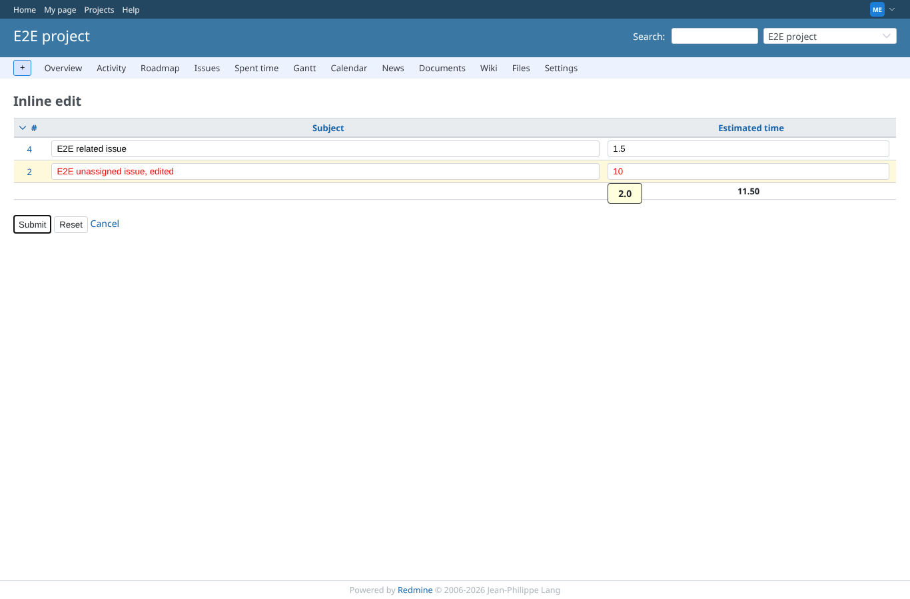
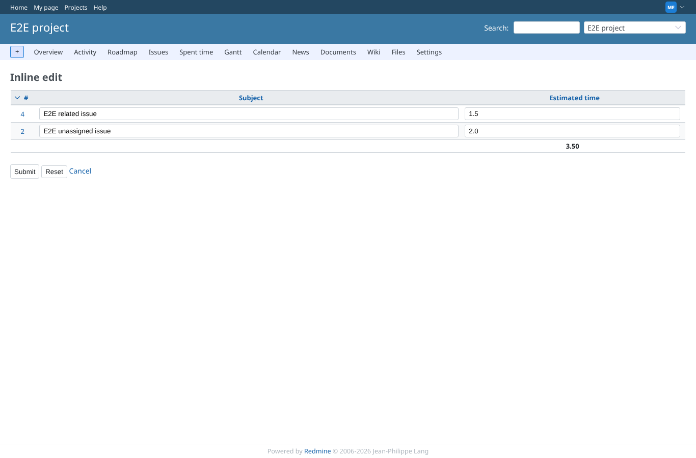
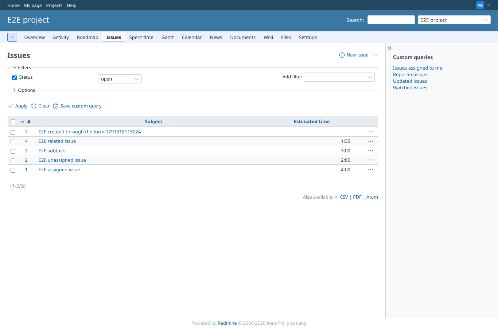

# client-side

Run 2026-10-06T20:22:08.886Z against http://127.0.0.1:3000.

| screenshot | user | URL | shows |
|---|---|---|---|
|  | manager | `/projects/e2e-project/inline_issues/edit_multiple?ids[]=2&ids[]=4&set_filter=1&c[]=subject&c[]=estimated_hours&back_url=%2Fprojects%2Fe2e-project%2Fissues` | An edited field is red; hovering it shows the original value |
|  | manager | `/projects/e2e-project/inline_issues/edit_multiple?ids[]=2&ids[]=4&set_filter=1&c[]=subject&c[]=estimated_hours&back_url=%2Fprojects%2Fe2e-project%2Fissues` | Estimated time changed to 10: the total follows (3.50 -> 11.50) before saving |
|  | manager | `/projects/e2e-project/inline_issues/edit_multiple?ids[]=2&ids[]=4&set_filter=1&c[]=subject&c[]=estimated_hours&back_url=%2Fprojects%2Fe2e-project%2Fissues` | Reset restores every value and the total |
|  | manager | `/projects/e2e-project/issues` | Cancel goes back to the issue list and saves nothing |
