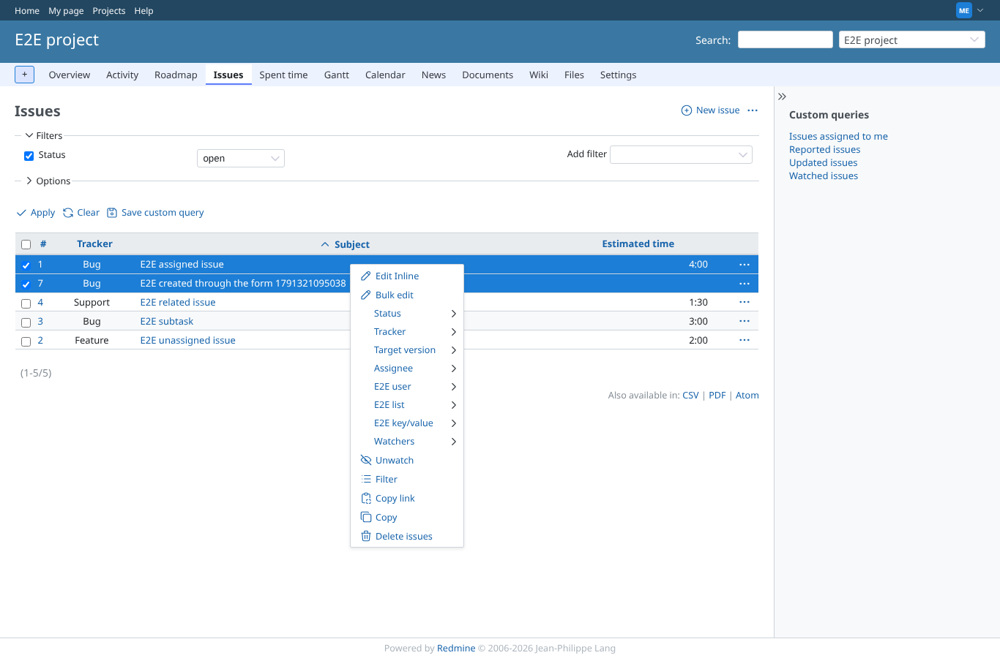
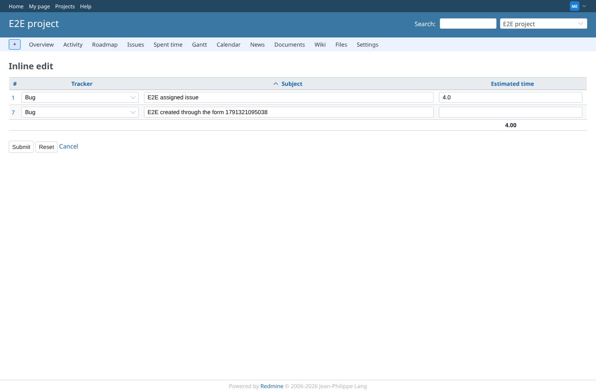
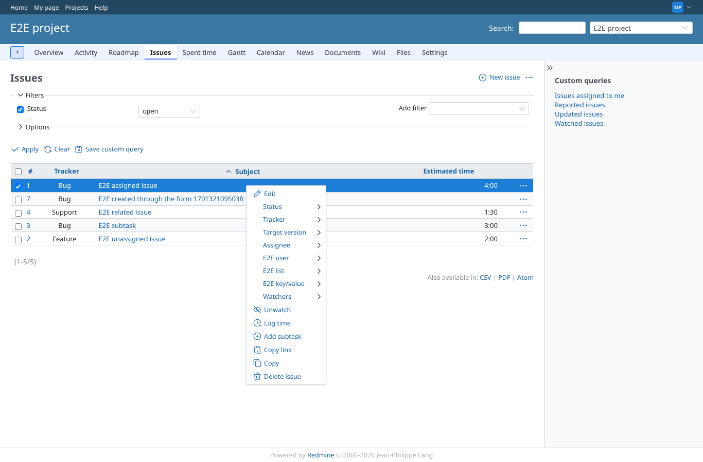
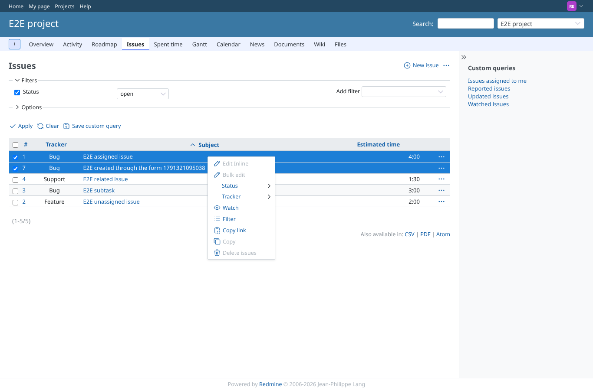

# context-menu

Run 2026-10-06T21:11:57.784Z against http://127.0.0.1:3000.

| screenshot | user | URL | shows |
|---|---|---|---|
|  | manager | `/projects/e2e-project/issues?set_filter=1&c[]=tracker&c[]=subject&c[]=estimated_hours&sort=subject` | Two issues selected: "Edit Inline" with the edit icon, enabled for a member with the permission |
|  | manager | `/projects/e2e-project/inline_issues/edit_multiple?back_url=%2Fprojects%2Fe2e-project%2Fissues%3Fc%255B%255D%3Dtracker%26c%255B%255D%3Dsubject%26c%255B%255D%3Destimated_hours%26set_filter%3D1%26sort%3Dsubject&c%5B%5D=tracker&c%5B%5D=subject&c%5B%5D=estimated_hours&ids%5B%5D=1&ids%5B%5D=7&sort=subject` | The item opens the inline edit form on the selected issues with the columns of the list |
|  | manager | `/projects/e2e-project/issues?set_filter=1&c[]=tracker&c[]=subject&c[]=estimated_hours&sort=subject` | On one issue the item is not offered (core edit is there) |
|  | developer | `/projects/e2e-project/issues?set_filter=1&c[]=tracker&c[]=subject&c[]=estimated_hours&sort=subject` | A member who may edit issues but lacks "Edit inline" sees the item disabled |
|  | reporter | `/projects/e2e-project/issues?set_filter=1&c[]=tracker&c[]=subject&c[]=estimated_hours&sort=subject` | A member without edit rights sees the item disabled |
