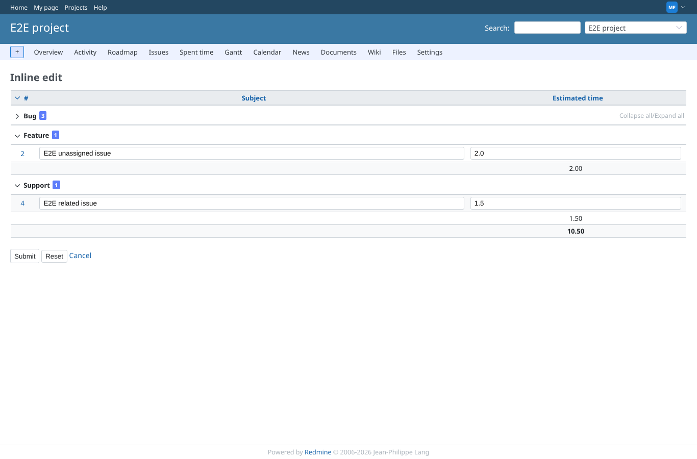
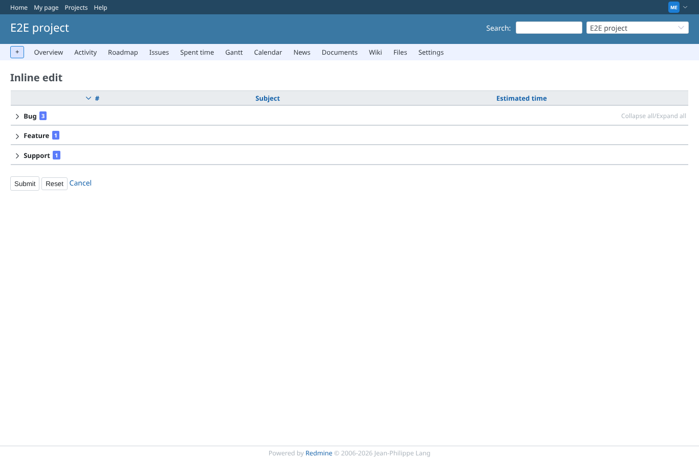
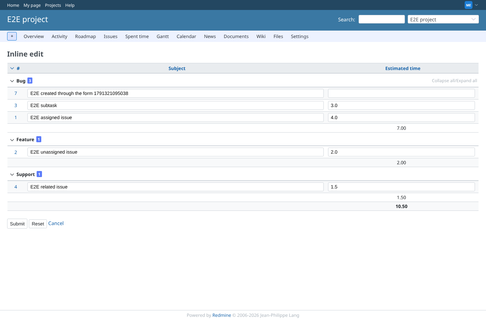

# grouping

Run 2026-10-06T21:12:14.186Z against http://127.0.0.1:3000.

| screenshot | user | URL | shows |
|---|---|---|---|
|  | manager | `/projects/e2e-project/inline_issues/edit_multiple?set_filter=1&status_id=o&group_by=tracker&c[]=subject&c[]=estimated_hours` | Grouped by tracker: 3 groups with the expander icon and estimated time per group (first: 7.00) |
|  | manager | `/projects/e2e-project/inline_issues/edit_multiple?set_filter=1&status_id=o&group_by=tracker&c[]=subject&c[]=estimated_hours` | The first group folded: its issues and its totals row are hidden, the icon points right |
|  | manager | `/projects/e2e-project/inline_issues/edit_multiple?set_filter=1&status_id=o&group_by=tracker&c[]=subject&c[]=estimated_hours` | "Collapse all" folds every group without a JavaScript error |
|  | manager | `/projects/e2e-project/inline_issues/edit_multiple?set_filter=1&status_id=o&group_by=tracker&c[]=subject&c[]=estimated_hours` | "Expand all" shows every group again |
