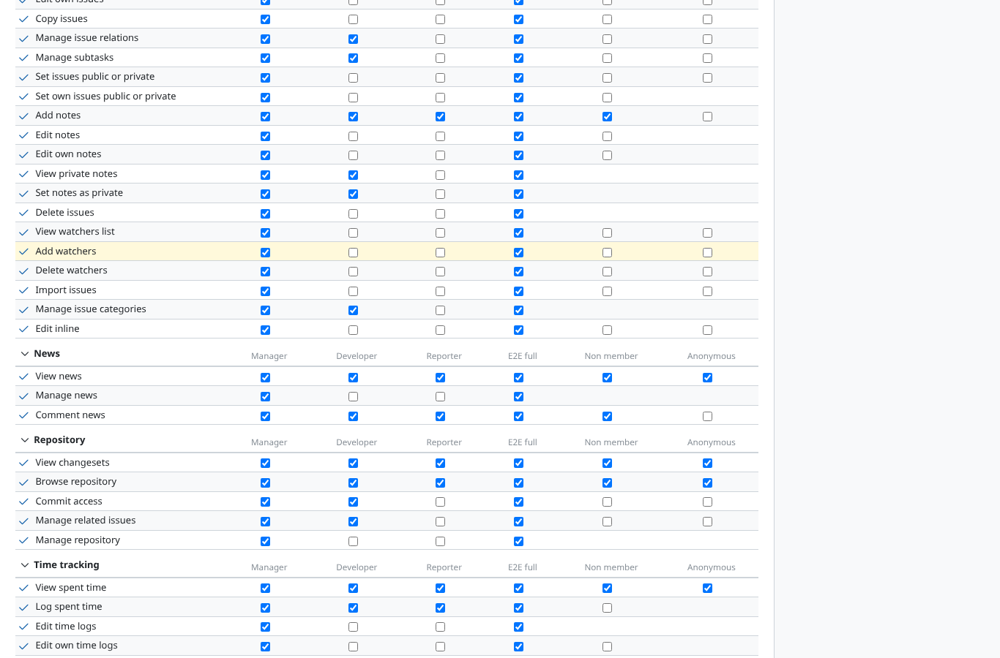

# permission

Run 2026-10-06T21:12:18.905Z against http://127.0.0.1:3000.

| screenshot | user | URL | shows |
|---|---|---|---|
|  | admin | `/roles/permissions` | "Edit inline" in the Issue tracking block of the permissions report: Manager, E2E full |
|  | manager | `/roles/permissions` | Only an administrator manages the permission (403 for a project manager) |
