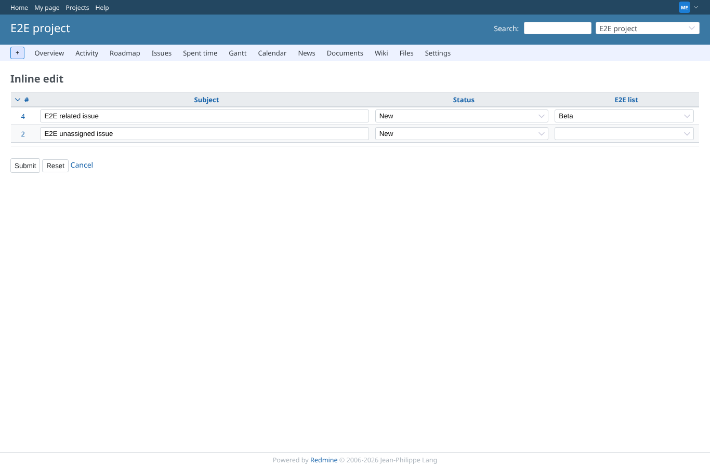
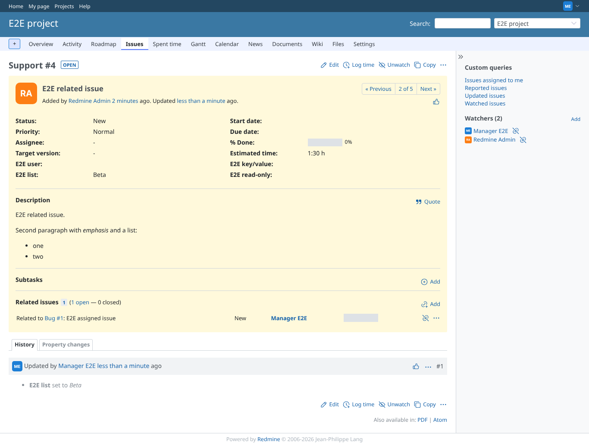
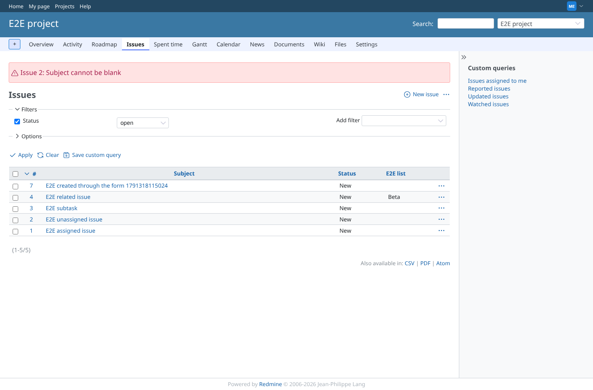
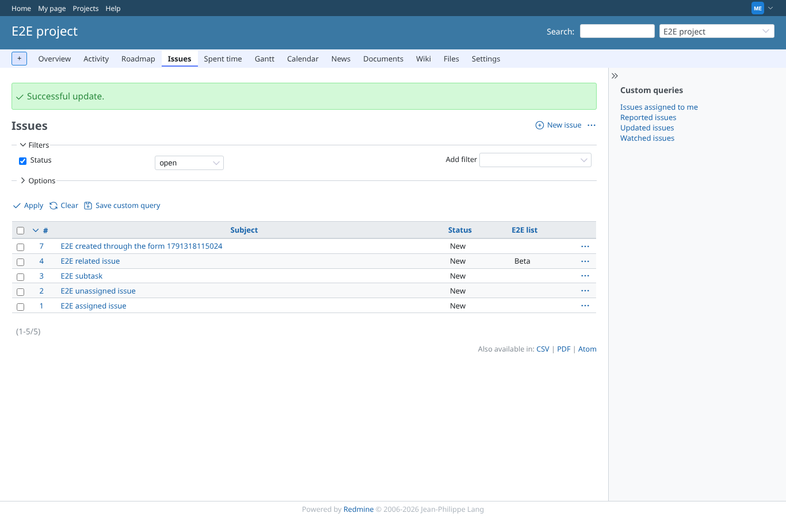
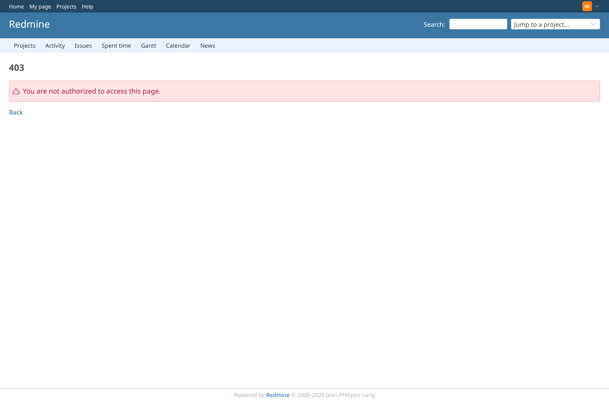
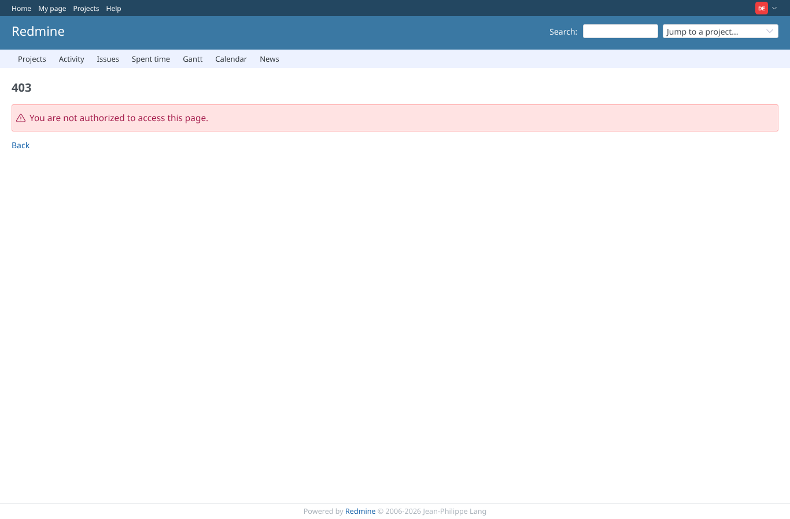

# save

Run 2026-10-06T20:23:01.757Z against http://127.0.0.1:3000.

| screenshot | user | URL | shows |
|---|---|---|---|
|  | manager | `/projects/e2e-project/inline_issues/edit_multiple?ids[]=4&ids[]=2&set_filter=1&c[]=subject&c[]=status&c[]=cf_2&back_url=%2Fprojects%2Fe2e-project%2Fissues` | Manager changed "E2E list" of #4 to Beta: the changed field turns red |
|  | manager | `/projects/e2e-project/issues` | Back on the issue list with "Successful update." |
|  | manager | `/issues/4` | The inline change is recorded in the issue history, by the manager |
|  | manager | `/projects/e2e-project/issues` | A blank subject is refused with the issue number; nothing is saved |
|  | manager | `/projects/e2e-project/issues` | A forged author_id and closed_on are ignored: only safe attributes are written |
|  | outsider | `/inline_issues/update_multiple?project_id=e2e-project&back_url=%2Fprojects%2Fe2e-project%2Fissues` | A non-member posting a change to an issue of the private project is refused (403) |
|  | editor | `/inline_issues/update_multiple?project_id=e2e-project&back_url=%2Fprojects%2Fe2e-project%2Fissues` | A user with the permission in e2e-project posting a change to an issue of e2e-private, which he cannot see, is refused (403) |
|  | reporter | `/inline_issues/update_multiple?project_id=e2e-project&back_url=%2Fprojects%2Fe2e-project%2Fissues` | A member without the permission is refused (403) |
|  | developer | `/inline_issues/update_multiple?project_id=e2e-project&back_url=%2Fprojects%2Fe2e-project%2Fissues` | A member who may edit issues but lacks "Edit inline" is refused (403) |
|  | manager | `/inline_issues/update_multiple?project_id=e2e-project&back_url=%2Fprojects%2Fe2e-project%2Fissues` | An unknown issue id answers 404 and saves nothing |
