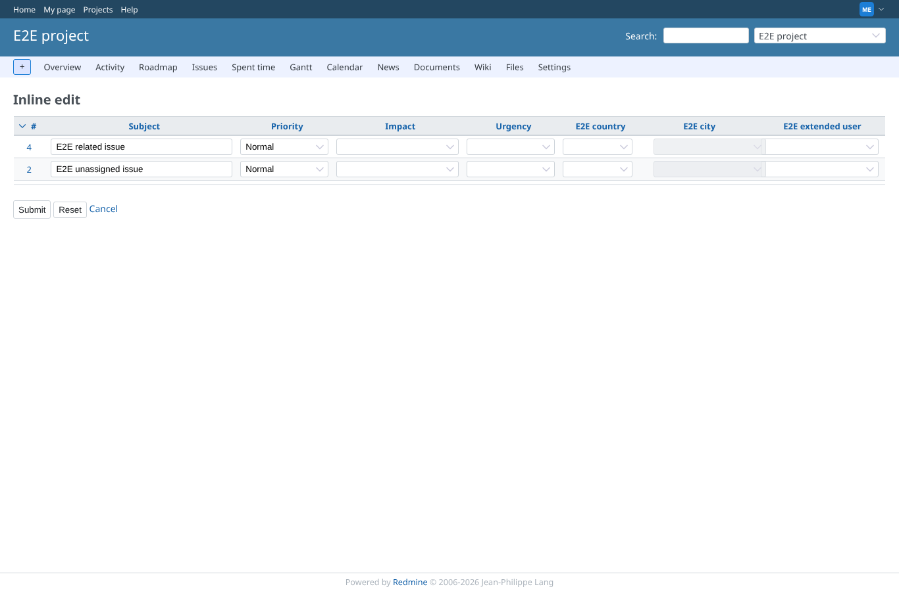
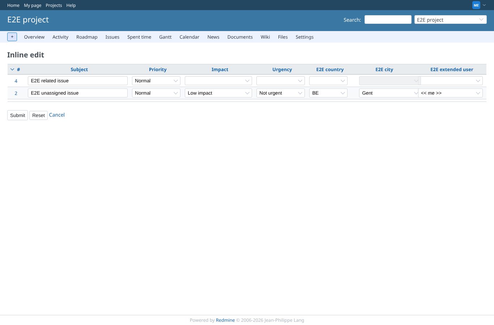
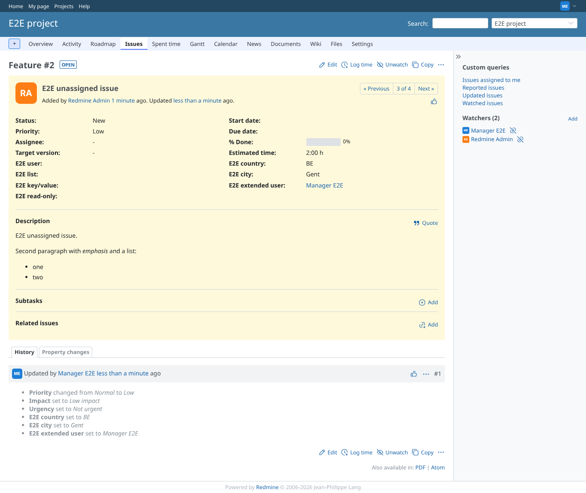

# together

Run 2026-10-06T19:55:29.848Z against http://127.0.0.1:3001.

| screenshot | user | URL | shows |
|---|---|---|---|
|  | manager | `/projects/e2e-project/inline_issues/edit_multiple?ids[]=2&ids[]=4&set_filter=1&c[]=subject&c[]=priority&c[]=impact_id&c[]=urgency_id&c[]=cf_5&c[]=cf_6&c[]=cf_7&back_url=%2Fprojects%2Fe2e-project%2Fissues` | ITIL impact and urgency, the depending lists and the extended user field as inputs on the inline form |
|  | manager | `/projects/e2e-project/inline_issues/edit_multiple?ids[]=2&ids[]=4&set_filter=1&c[]=subject&c[]=priority&c[]=impact_id&c[]=urgency_id&c[]=cf_5&c[]=cf_6&c[]=cf_7&back_url=%2Fprojects%2Fe2e-project%2Fissues` | Impact 1, urgency 1, country BE (cities limited to Gent/Brussel), city Gent, extended user << me >> |
|  | manager | `/issues/2` | Saved: priority Normal -> Low from impact x urgency, depending lists and extended user in the history |
