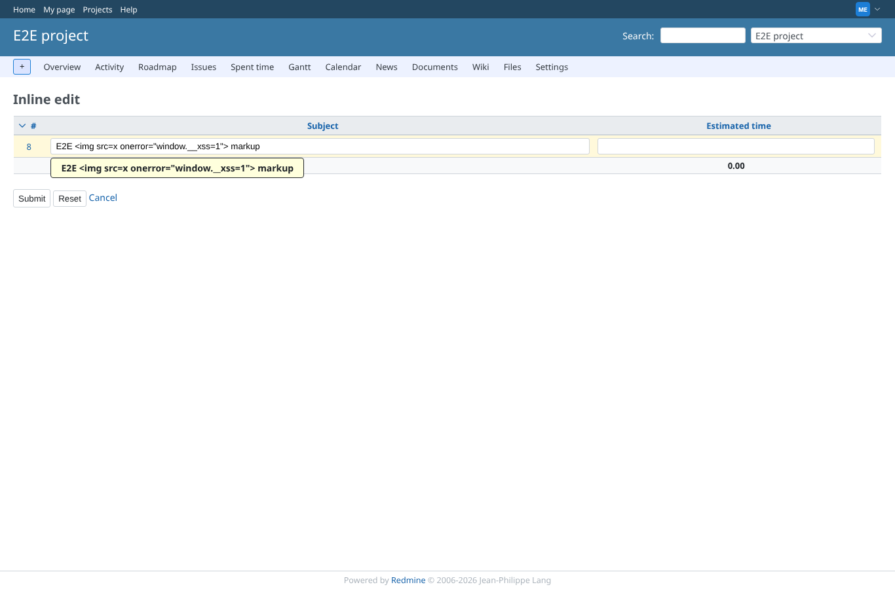
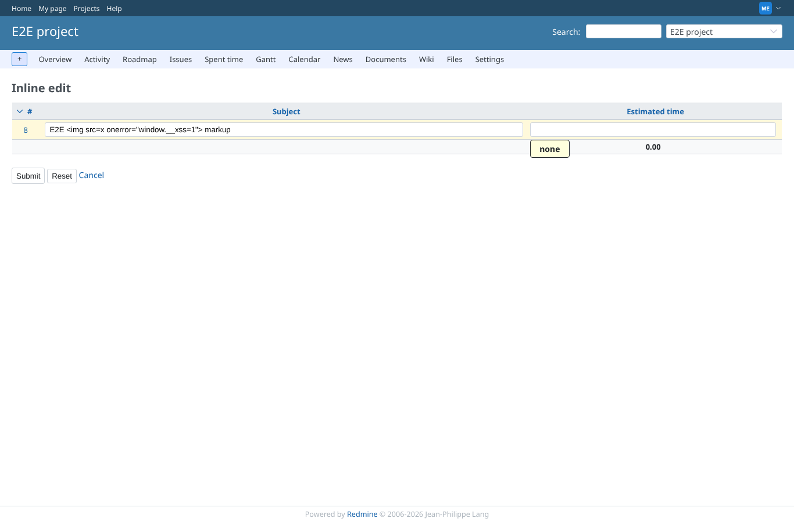

# tooltip

Run 2026-10-06T20:47:11.877Z against http://127.0.0.1:3000.

| screenshot | user | URL | shows |
|---|---|---|---|
|  | manager | `/projects/e2e-project/inline_issues/edit_multiple?ids[]=8&set_filter=1&c[]=subject&c[]=estimated_hours` | A subject with HTML markup is shown as text in the tooltip; nothing runs |
|  | manager | `/projects/e2e-project/inline_issues/edit_multiple?ids[]=8&set_filter=1&c[]=subject&c[]=estimated_hours` | An empty original value shows the translated "none" |
